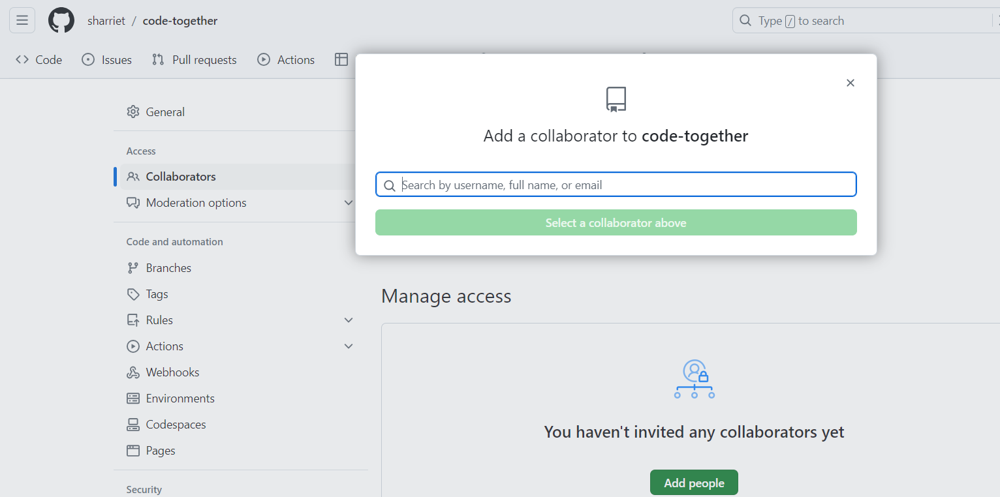
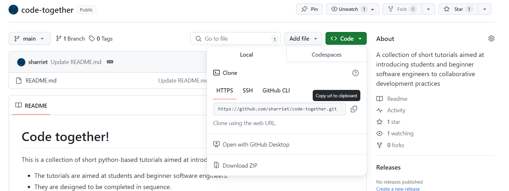
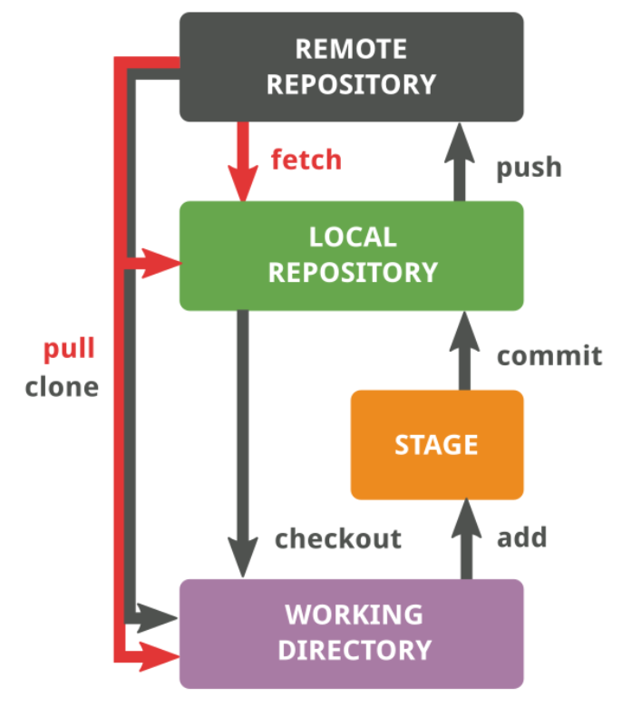
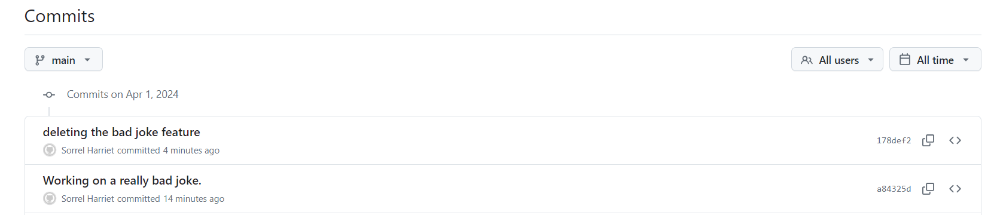
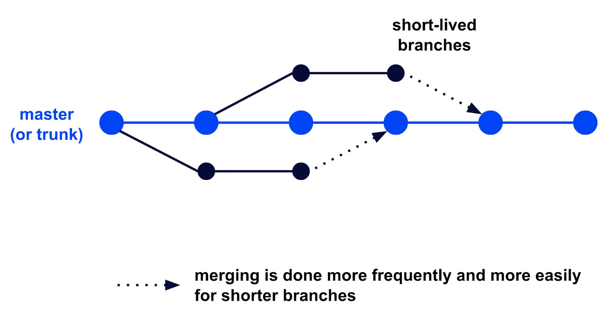

# Tutorial 1: Git basics

+ This tutorial will introduce you to some basic git commands.
+ It will teach you just enough to be able collaborate with others on a shared coding project.
+ It assumes you will be working with a team of people you know.
+ To continue learning, refer to the links at the bottom of the tutorial.

## Before getting started...

+ Check you have [git](https://git-scm.com/downloads) installed
+ [Visual Studio Code](https://code.visualstudio.com/download) is recommended

## Step 1: Create a personal github account

**Everyone in your team needs to complete this step independently.**

+ Navigate to [https://github.com](https://github.com)
+ Click **Sign up** to register a free account
    - Refer to the [GitHub Documentation](https://docs.github.com/en/get-started/start-your-journey/creating-an-account-on-github) if you encounter issues

## Step 2: Create a github repo for your project

A repository is a bit like a folder that groups together items that belong in the same project.
In Step 3 we'll give everyone in your team access to the same repository so they can work on the project together.

**Only one person in your team needs to do this step.**

+ In the upper-right corner of any page, select , then click New repository.
+ In the "Repository name" box, type a short but descriptive name for your project. 
    - Your repository name should be lowercase, with words separated by "-"
    - For example, "study-buddy-app"
+ In the "Description" box, type a short description. 
    - For example, type "This repository is for a Study Buddy app."
+ Select whether your repository will be Public or Private.
+ Select Add a README file.
+ Click Create repository.

## Step 3: Make your team members collaborators

In this step you'll add members of your team as collaborators on your project.

**Only one person in your team needs to do this step.**

+ From your repository, click **Settings**
+ Select **Collaborators** from the menu on the left
+ Select **Add People** and search for your team members by Username, Full Name, or Email

For more information, refer to this section of the [GitHub Documentation](https://docs.github.com/en/account-and-profile/setting-up-and-managing-your-personal-account-on-github/managing-access-to-your-personal-repositories/inviting-collaborators-to-a-personal-repository)

## Step 4: Clone the repository to your local workspace

In this step, everyone in your team will make a "clone" of the repository in their local working directory.
This will allow you to work on the codebase independently.
Later, we'll learn how to manage the workflow so that the remote repository on GitHub stays clean and up to date.
Your remote repository can be thought of as a central source of truth, while your local copies are where the work happens.

**Everyone in your team needs to complete this step independently.**

+ In GitHub, from the **Code** tab of your repository, click **Code**
+ Copy the HTTPS URL

+ Open Visual Studio Code
+ From the files **Explorer** tab, click **Clone Repository** 

From Visual Studio Code there are a couple of ways you can [clone a repository](https://learn.microsoft.com/en-us/azure/developer/javascript/how-to/with-visual-studio-code/clone-github-repository?tabs=activity-bar#clone-repository). In this tutorial, we'll use the Integrated Terminal method.

+ Open an integrated terminal from **Terminal** -> **New Terminal**
+ In the terminal, navigate to the place in your file system where you'd like to clone the repository
+ Clone your repository with the following command:

        git clone https://github.com/YOUR-NAME-OR-ORGANIZATION/YOUR-REPO-NAME

    - In the above, you can paste the URL you copied earlier.
+ Navigate into the new folder:

        cd YOUR-REPO-NAME

+ Then open it in Visual Studio Code:

        code .

## Step 5: Make your first commit

Having reached this step, you should all have a local copy of the remote repository in your working directory.

In this step, you'll each practice 'staging' and 'committing' a new file to the remote repository.

**Everyone in your team needs to complete this step independently.**

+ From Visual Studio Code, with your project open, go to **File** > **New File**
+ When prompted to enter a name for the file, call it `your-name.md` (replacing 'your-name' with your name)
    - For example, `sorrel-harriet.md`
+ Inside the new file, write a joke or greeting for your team members
+ Save your changes
+ Open the **Terminal** (View > Terminal)
+ **Stage** the new file for commit:

        git add your-name.md

    - This is like saying to git, "start watching this file"

+ **Commit** the changes: 

        git commit

    - This creates a record of the changes you've made in the project's version history. The set of changes is assigned a unique SHA-1 hash code which enables us to identify it in the future.

+ Enter a commit message
    - At this point, you'll be prompted to enter a commit message from a GNU editor.
    - The commit message describes the change to your collaborators.
    - This can be something like, "Adding new greeting feature"
    - Exit the editor with `Ctrl` + `x`, `y` to save changes, then `Return`

**NB:** For future reference, you can include the commit message in the commit command using the `-m` option:

        git commit -m "some commit message"

+ **Push** the new version to the remote repository: 

        git push origin main
        
    - This step applies your changes to the remote repository.

## Step 6: View your version history

+ Visit your remote repository on GitHub.
+ Under **Commits**, you should be able to see a summary of the changes that have been made to your repository. It should include changes made by other team members.

    - Since you have all worked on separate files, git will have had no problem **merging** the changes you each made independently. Had you all worked on the same file, there would be potential for **merge conflicts**.
    - Assuming the 'main' branch of the project is the one that contains deployable code, we don't want to risk messing it up while working on a set of changes.
    - In the next few steps, we'll learn how we can safely work the code base without risking messing up the main branch.
    - From now on, we'll think of the main branch as the 'trunk' (like a tree trunk).
    - Whenever we want to make some changes, we should create a new 'branch' to do our work.
    - After we've done our work, and are satisfied our code is well tested and contains no defects, we can then **merge** the branch back into the trunk (main).
    - This workflow is called **trunk based development** (TBD). In TBD, branches should be shortlived (i.e. they not exist for more than a couple of days.) The code in the trunk should always be in a deployable state.

**NB:** For more information about TBD and alternative workflows, such as feature-based development, refer to the recommended resources and further reading.

## Step 7: Create a new branch

## Recommended resources and further reading
+ [Using git with Visual Studio Code](https://code.visualstudio.com/docs/sourcecontrol/overview#:~:text=VS%20Code%20will%20use%20your,currently%20have%20in%20your%20repository.)
+ [Thread discussing the differences between trunk based development (TBD) and gitflow](https://softwareengineering.stackexchange.com/questions/442910/what-is-the-difference-between-trunk-based-development-and-gitflow)
+ [Using GitHub Flow](https://docs.github.com/en/get-started/using-github/github-flow)
+ Trisha Gee (2023) [Why I prefer trunk based development](https://trishagee.com/2023/05/29/why-i-prefer-trunk-based-development/)
+ Jacob Schmitt (2023) [Trunk vs Feature Based Development](https://circleci.com/blog/trunk-vs-feature-based-dev/)

