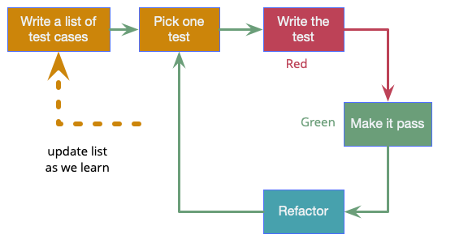
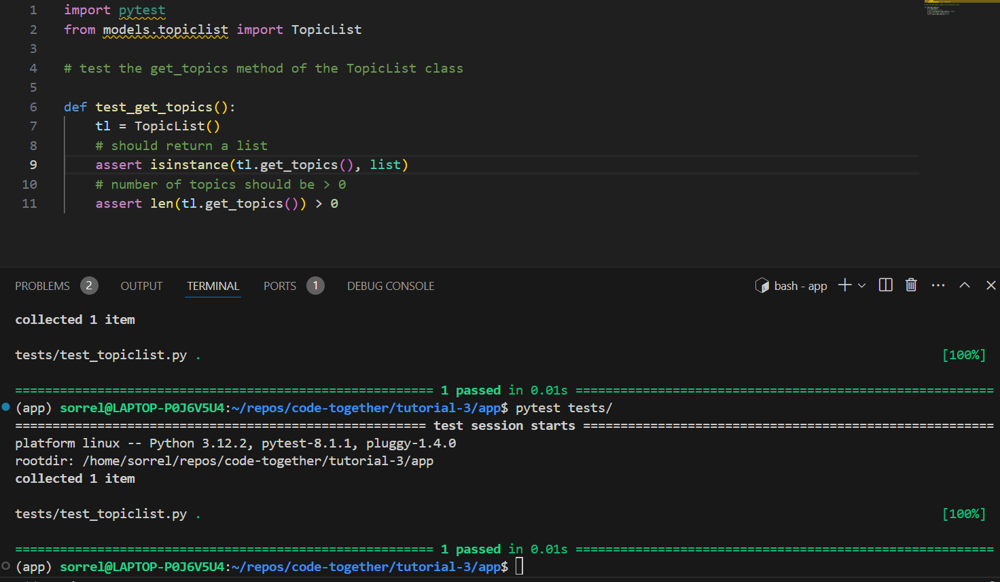

# Tutorial 3: TDD with python and pytest

This tutorial will aim to walk you through the first stages of developing a python application using a Test Driven Development (TDD) approach. You should be pairing with another member of your team for this tutorial.

Since your application will have different requirements to the one used in the examples, you will need to think hard for Steps 5-7, and communicate frequently with your pairing partner and team.

## Important things to note before getting started...

It is recommended that your team uses python to develop its software project. This will make it easier to adopt the collaborative development practices documented in these tutorials. If you do use another language, you will need to look for an equivalent test framework. Failure to implement tests (an important mark of software quality) will affect your mark.

You should also develop the habit of using [virtual environments](https://docs.python.org/3/tutorial/venv.html) for developing python applications. These are isolated python environments that can be consistently replicated across different machines. We don't want a situation where one team member is using a different version of python, or a different version of a python package from other members of the team! 

## Pre-requisites

### Complete tutorials 1 and 2
You'll need to complete tutorials [1](../tutorial-1/) and [2](../tutorial-2/) before attempting this tutorial. The pre-requisites for Tutorial 2 apply here too (such as having a well defined user story to work on.)

### Install Visual Studio Code with WSL
This tutorial assumes you will use **Visual Studio code with the WSL extension** to develop and execute your python code. WSL refers to the Windows Subsystem for Linux, which allows you to run a Linux environment on your Windows machine. Many python developers prefer to develop on Linux as some packages will not work properly on Windows, and code may execute faster on Linux-based operating systems.

+ [Follow these instructions to install WSL2](https://learn.microsoft.com/en-gb/windows/wsl/install)
+ Next [follow these instructions to install VS code with the WSL extension](https://learn.microsoft.com/en-us/windows/wsl/tutorials/wsl-vscode).

The commands in this tutorial will be slightly different if you're using Windows without WSL. Where applicable, I have tried to link you to some resources that may help.

### Install Python 3.12
The tutorial assumes you'll use the latest stable version of python which is currently 3.12.

From the integrated terminal, check you have python 3.12 installed:

        python --version

If you haven't got it, you should install it. 

### Install the `venv` package
If you're on a Mac, Linux or WSL, you may need to install the [`venv`](https://docs.python.org/3/library/venv.html) package for python:

On Windows, it should already be installed.

**Once you have done all of the above, you're ready to start!**

## Step 1: Create a virtual environment for your python project

+ From the integrated terminal:

        python3.12 -m venv ./appname

In the above, replace 'appname' with the name of your application.

## Step 2: Activate the virtual environment

+ From the terminal:

        source /appname/bin/activate

At this point you should see the command line prompt changes, indicating you are now in the virtual environment.

+ To deactivate, you can simply do:

        deactivate

## Step 3: Install the pytest library

We'll use the [pytest framework](https://docs.pytest.org/en/8.0.x/) to write unit tests for our code.

**Make sure your virtual environment is activated before completing this step.**

+ Install the pytest package with pip, which is a package manager for python:

        pip install python

**Note:** this installs the package in the virtual environment only - not on your system-wide python install, which is really handy as it means we can have many python projects using different versions of the same packages, and it also avoids package conflicts.

## Step 4: Create a structure for your application

**You are advised to consult your team here if you plan to deviate from my example.**

+ Create a skeleton structure for your application as follows:

                app/
                        models/
                                __init__.py
                        tests/
                                __init__.py
The `__init__.py` files are needed for the models and tests directories to be recognised as packages.

**Tip:** From the terminal with WSL, you can easily create new files with the `touch` command:

                touch app/models/__init__.py

## Step 5: Write a failing test

The basic workflow for TDD is illustrated below. We'll try to follow this as closely as possible, though what you're able to implement in practice without mocking frameworks or databases etc may be minimal. That's OK, we're here to learn best practices, not to make fully functional software!

+ Inside `tests/`, create a file, `test_mymodel.py`
        - In the above, replace 'mymodel' with the name of the class you are planning to implement. For example, I am about to implement a TopicList class, hence I will call my python file, `test_topiclist.py`.
+ Open the test file you just created
+ Identify a method of the class you intend to write, which is needed for your story to meet its acceptance criteria
        - For example, TopicList needs a `get_topics()` method, which will return the topics data
+ Identify one or more criteria that will allow us to know if this method is behaving correctly
        - For example, `get_topics()` should return a list, and its length should be greater than 0
        - We may need to add to this list of pass criteria later, so keep it simple for now!
+ Write a single test for your method
        - Use `assert` statements to evaluate your test criteria
        - Here is an example:

                def test_get_topics():
                        tl = TopicList()
                        assert isinstance(tl.get_topics(), list)
                        assert len(tl.get_topics()) > 0
        - In the above, I define a function, `test_get_topics()` (in pytest, all tests should be prefixed with `test_`, followed by the name of the method or function they are testing.)
        - I then create an instance of my TopicList class (which I haven't written yet)
        - I then include 2 assert statements to evaluate whether the `get_topics()` method returns a list of length > 0
+ Run the test from the integrated terminal:

                pytest tests/
        - Of course it will FAIL with a NameError because we haven't written the class yet!
+ Create a file called `mymodel.py` in your models directory (replacing mymodel with the name of the class)
        - For example, I have created a `topiclist.py` file
+ In the new file, define the class, but without any code in it. For example,

                class TopicList:
                        pass
+ Import the class into the top of your test script. For example,

                from models.topiclist import TopicList

+ Run pytest again
        - This time you should receive an AttributeError, because we haven't defined the method we're trying to test yet.

## Step 6: Write the minimum code to pass the tests

+ Next implement the minimum amount of code in your class definition to make the tests pass.
        - Here's my example:

                class TopicList:
    
                        # Instance method
                        def get_topics(self):
                                return [1,2,3,4]
+ Re-run your test. Eventually you should see some satisfying green passes:

Clearly my code is not finished yet, because the data returned by the method is all wrong! This means I need to write better tests to verify that the data is in the correct format.

## Step 7: Write more tests before writing more code!

+ Add more test cases to your test function, or create additional test functions if you have more than one method you need to test.
+ Run the tests - which will probably fail the first time you run them!
+ Add just enough new code to pass the tests
        - Take a look at my example code in the [`app/`](app/) directory!

## Step 8: Commit your work

At this stage you need to add, commit, push your work to the remote repository as before.

+ **Don't** add and commit any files related to your python virtual environment!
+ **Only** add the files in your `data`, `models` and `tests` directories

## Step 9: Create a requirements file

In order for others to be able to recreate your virtual environment, we need to make a `requirements.txt` file which will be stored along with our source code. We can do this with `pip freeze`.

+ Generate a `requirements.txt` file:

                pip freeze > requirements.txt
+ Add, commit and push the requirements file to the remote repository on git

## Step 10: Create a README file for your application

Every code project needs a README file! This should include instructions for others on how to run and use your application. To start with, we'll keep ours very lightweight, with a simple set of instructions for recreating the virtual environment and running the tests.

+ Create a `README.md` file in the base of your local repository
+ Add some text to your README file, which should include something like the following:

        From a terminal, clone this repository:

                git clone 
        Navigate into the app directory:

                cd app/
        Initialise a python virtual environment running python 3.12:

                python3.12 -m venv .
        Activate the virtual environment:

                source bin/activate
        Install the dependencies required for this application to run:

                pip install -r requirements.txt
        Run the tests:

                pytest tests/
+ Add, commit, push your README file to the remote

## Further reading

+ Martin Fowler (2023) [Test Driven Development](https://martinfowler.com/bliki/TestDrivenDevelopment.html)
+ Jacob Schmitt (2024) [Test Driven Develoment Explained](https://circleci.com/blog/test-driven-development-tdd/)
+ Kent Beck (2002) [Test Driven Development By Example](https://www.amazon.co.uk/Test-Driven-Development-Addison-Wesley-Signature/dp/0321146530)
+ [Virtual Environment Documentation](https://docs.python.org/3/library/venv.html)